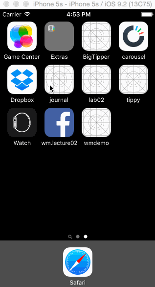

## CodePath iOS for Designers: Group Poject by Tony Yeung and Sumit Kholi

### A Photo/Video Journaling App that is minimal & clean
This is a wireframe of the fantastic [Grid Diary](https://itunes.apple.com/us/app/grid-diary-write-personal/id597077261?mt=8) app on the Apple App Store

### Wireframes

### User Stories
User is able to add photos to journal entries.

User is able to add videos to journal entries.

User is able to stich photos together to emulate a short video, possibly using photos from sports/burst mode.

User is able to create journal "mood" entries according to his/her mood at the time, with helpful "mood" questions to facilitate creating the journal
